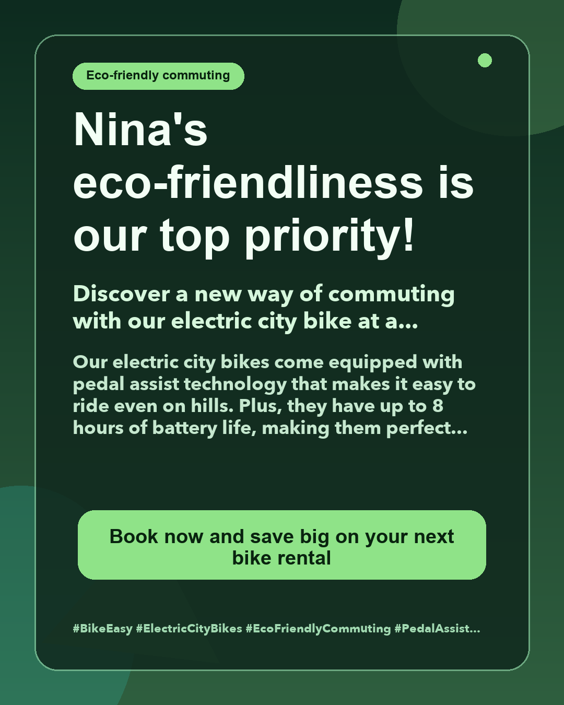

# LLM-Powered Ad Generator (TinyLlama + Streamlit)

A generative AI application that produces structured, validated marketing ads using a local LLM (TinyLlama 1.1B). Built with LangChain prompt templates, a validation/retry loop, and a Streamlit web UI that renders the generated ad as a downloadable PNG.



## What It Does

Given a set of campaign inputs (bike specs, discount, theme, channel, tone), the app:
1. Builds a structured prompt using a LangChain `PromptTemplate`
2. Generates ad copy with TinyLlama (locally, no API key required)
3. Validates the output against brand rules (required sections, name in headline, #BikeEase hashtag)
4. Retries up to N times and keeps the highest-scoring version
5. Renders the best ad as a formatted PNG and offers a download button

## Models Supported

The notebook explores several open-source models — swap `MODEL_NAME` to try others:

| Model | Notes |
|-------|-------|
| `TinyLlama/TinyLlama-1.1B-Chat-v1.0` | Default — fast on CPU |
| `google/flan-t5-base` / `flan-t5-large` | Seq2Seq — remove prompt slice in `_generate_text` |
| `facebook/opt-1.3b` | Causal LM |
| `tiiuae/falcon-rw-1b` | Causal LM |
| `microsoft/phi-2` | Higher quality, slower |

## Quick Start

```bash
git clone https://github.com/NinaSo/genai-ad-generator.git
cd genai-ad-generator
python3 -m venv .venv
source .venv/bin/activate
pip install -r requirements.txt
streamlit run app.py
```

> First run will download the TinyLlama model weights (~2.2 GB). No GPU required — CPU works, but generation is slower.

## App Features

- **Sidebar controls**: model device (CPU/GPU), system message, prompt template, retries, font size, ad layout, ad dimensions
- **Inputs**: user name, bike specs, discount, campaign theme, channel, tone
- **Output**: formatted ad text + PNG preview + download button
- **Customizable**: all prompt placeholders (`{user_name}`, `{product_specs}`, `{discount}`, `{theme}`, `{channel}`, `{tone}`) are editable in the sidebar for any brand/campaign

## File Structure

```
repo_genai_ad_generator/
├── app.py                        # Streamlit UI
├── notebook_code.py              # Standalone script version of the pipeline
├── ad_generator_notebook.ipynb   # Original notebook: model exploration + prompt engineering
├── core/
│   ├── ad_generator.py           # Model load, prompt build, generation, validation, retries
│   └── visuals.py                # PNG rendering from structured ad sections
├── requirements.txt
├── generated_ad-example.png      # Sample output
└── README.md
```

## How It Works

```
User inputs (specs, discount, theme, channel, tone, name)
  → LangChain PromptTemplate → system message + user content
  → TinyLlama tokenizer + model.generate()
  → Extract <AD>...</AD> block
  → Normalize labels (case/format)
  → Validate: required sections ✓  |  name in headline ✓  |  #BikeEase ✓
  → Retry up to N times, keep best-scoring version
  → Render PNG via Pillow
```

## Prompt Engineering Notes

- System message enforces strict output format (`[HEADLINE]`, `[SUBHEADLINE]`, `[BODY]`, `[CTA]`, `[HASHTAGS]`)
- Model is instructed not to invent prices, distances, or features not in the specs
- `<AD>...</AD>` tags + `[END]` sentinel provide reliable extraction anchors
- Temperature 0.3 + `repetition_penalty=1.15` + `no_repeat_ngram_size=4` balance coherence and variety
